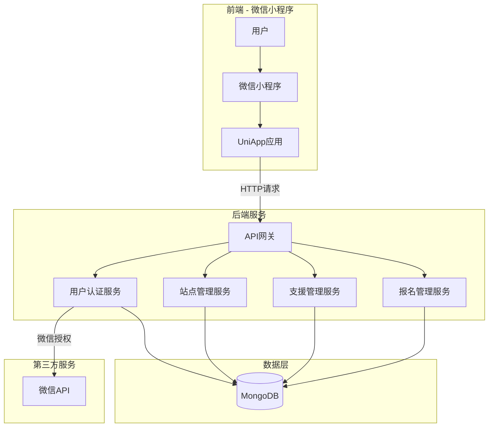
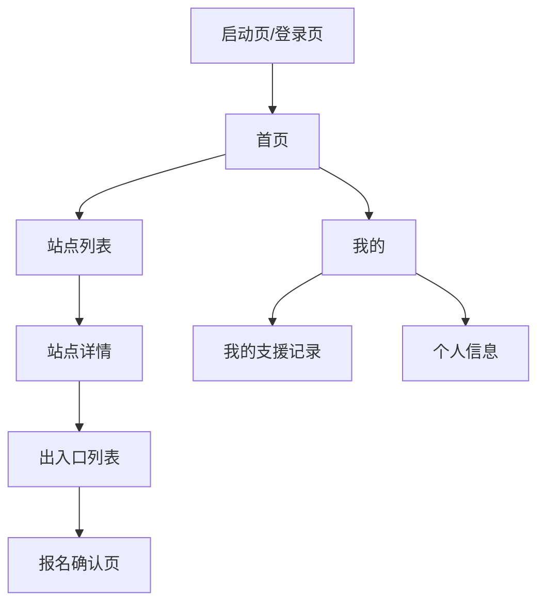

# 地铁站站务员支援系统 - 详细设计计划

## 1. 项目概述

### 1.1 项目背景
地铁站站务员支援系统是一个基于微信小程序的应用，用于管理地铁站各出入口的人员分配和支援报名。站务员可以查看各站点的出入口人员需求情况，并进行支援报名。

### 1.2 核心功能
- 微信授权登录
- 查看地铁站列表
- 查看站点各出入口人员状态（缺人/不缺人）
- 支援报名功能
- 我的支援记录查看

---

## 2. 系统架构

### 2.1 技术栈

#### 前端
- **框架**: UniApp + Vue 3
- **构建工具**: Vite
- **UI组件**: uView UI
- **状态管理**: Pinia
- **网络请求**: uni.request / axios

#### 后端
- **运行环境**: Node.js
- **框架**: Express.js
- **数据库**: MongoDB
- **认证**: JWT + 微信小程序登录
- **部署**: 云服务器

### 2.2 系统架构图



---

## 3. 数据模型设计

### 3.1 用户表 (User)

```javascript
{
  _id: ObjectId,
  openid: String,           // 微信openid
  nickname: String,         // 昵称
  avatar: String,           // 头像
  phone: String,            // 手机号
  staffId: String,          // 工号
  stationId: ObjectId,      // 所属站点ID（可选）
  createdAt: Date,
  updatedAt: Date
}
```

### 3.2 地铁站表 (Station)

```javascript
{
  _id: ObjectId,
  name: String,             // 站点名称
  code: String,             // 站点代码
  line: String,             // 所属线路
  location: {
    lat: Number,            // 纬度
    lng: Number             // 经度
  },
  status: String,           // 状态: active/inactive
  createdAt: Date,
  updatedAt: Date
}
```

### 3.3 出入口表 (Entrance)

```javascript
{
  _id: ObjectId,
  stationId: ObjectId,      // 所属站点ID
  name: String,             // 出入口名称（如：A口、B口）
  type: String,             // 类型: entrance/exit
  requiredStaff: Number,    // 需要人数
  currentStaff: Number,     // 当前人数
  status: String,           // 状态: short(缺人)/full(不缺人)/normal
  createdAt: Date,
  updatedAt: Date
}
```

### 3.4 支援任务表 (SupportTask)

```javascript
{
  _id: ObjectId,
  stationId: ObjectId,      // 支援站点ID
  entranceId: ObjectId,     // 支援出入口ID
  userId: ObjectId,         // 报名用户ID
  status: String,           // 状态: pending/confirmed/completed/cancelled
  supportDate: Date,        // 支援日期
  startTime: String,        // 开始时间
  endTime: String,          // 结束时间
  createdAt: Date,
  updatedAt: Date
}
```

---

## 4. 页面结构设计

### 4.1 页面导航结构



### 4.2 页面清单

| 页面名称 | 路径 | 功能描述 |
|---------|------|---------|
| 启动页 | /pages/startup | 微信授权登录 |
| 首页 | /pages/index | 快捷入口、通知公告 |
| 站点列表 | /pages/stations/list | 查看所有地铁站 |
| 站点详情 | /pages/stations/detail | 查看站点信息和出入口概览 |
| 出入口列表 | /pages/entrances/list | 查看站点各出入口人员状态 |
| 报名确认页 | /pages/booking/confirm | 确认支援报名 |
| 我的 | /pages/mine/index | 个人中心入口 |
| 我的支援 | /pages/mine/supports | 查看我的支援记录 |
| 个人信息 | /pages/mine/profile | 编辑个人信息 |

---

## 5. 后端API接口设计

### 5.1 用户认证模块

| 接口 | 方法 | 说明 |
|-----|------|-----|
| `/api/auth/login` | POST | 微信登录，获取token |
| `/api/auth/refresh` | POST | 刷新token |
| `/api/user/profile` | GET | 获取用户信息 |
| `/api/user/profile` | PUT | 更新用户信息 |

### 5.2 站点管理模块

| 接口 | 方法 | 说明 |
|-----|------|-----|
| `/api/stations` | GET | 获取站点列表 |
| `/api/stations/:id` | GET | 获取站点详情 |
| `/api/stations/:id/entrances` | GET | 获取站点出入口列表 |

### 5.3 出入口管理模块

| 接口 | 方法 | 说明 |
|-----|------|-----|
| `/api/entrances` | GET | 获取出入口列表（支持筛选） |
| `/api/entrances/:id` | GET | 获取出入口详情 |
| `/api/entrances/:id/status` | GET | 获取出入口人员状态 |

### 5.4 支援报名模块

| 接口 | 方法 | 说明 |
|-----|------|-----|
| `/api/supports` | POST | 创建支援报名 |
| `/api/supports` | GET | 获取支援记录列表 |
| `/api/supports/:id` | GET | 获取支援记录详情 |
| `/api/supports/:id/cancel` | POST | 取消支援报名 |

---

## 6. 功能模块详细设计

### 6.1 微信授权登录
- 调用 `uni.login()` 获取 code
- 将 code 发送到后端换取 openid 和 session_key
- 生成 JWT token 返回给前端
- 前端存储 token 用于后续请求

### 6.2 站点列表展示
- 展示所有地铁站列表
- 支持按线路筛选
- 显示站点状态（是否缺人）
- 点击进入站点详情

### 6.3 出入口人员状态展示
- **缺人状态**：红色标识，显示"缺人"
- **不缺人状态**：绿色标识，显示"已满"
- **正常状态**：黄色标识，显示"正常"
- 显示当前人数/需要人数

### 6.4 支援报名功能
- 选择出入口
- 选择支援日期和时间
- 确认报名信息
- 提交报名
- 报名成功后更新出入口人数

### 6.5 我的支援记录
- 查看所有报名记录
- 显示报名状态（待确认/已确认/已完成/已取消）
- 支持取消待确认的报名

---

## 7. 分步验收开发计划

### 开发原则
- 每完成一个功能模块立即启动服务进行实时验收
- 启动后端服务和前端开发服务器
- 配合微信开发者工具或浏览器进行实时预览
- 每个步骤完成后等待用户确认验收通过，再进行下一步

---

### 步骤 1: 后端项目初始化

**任务内容：**
- [ ] 创建后端项目目录结构
- [ ] 初始化 package.json
- [ ] 配置 Express 基础服务
- [ ] 配置 MongoDB 连接
- [ ] 创建基础路由结构

**验收标准：**
- 后端服务能正常启动（端口 3000）
- 访问 http://localhost:3000/api/health 返回 `{"status":"ok"}`
- MongoDB 连接成功，控制台输出连接信息

**验收方式：**
- 开发者启动后端服务
- 用户在浏览器访问 http://localhost:3000/api/health 验证
- 确认返回 `{"status":"ok"}` 后验收通过

---

### 步骤 2: 微信登录接口

**任务内容：**
- [ ] 实现微信 code 换取 openid 接口
- [ ] 实现 JWT token 生成和验证
- [ ] 创建用户数据模型
- [ ] 实现登录接口 `/api/auth/login`

**验收标准：**
- 能接收微信 code 并返回 token
- token 能正确验证用户身份
- 用户数据正确存储到 MongoDB

**验收方式：**
- 开发者提供测试接口地址
- 用户使用 Postman 或 curl 测试登录接口
- 确认返回 token 和用户信息后验收通过

---

### 步骤 3: 前端页面框架搭建

**任务内容：**
- [ ] 安装 uView UI 组件库
- [ ] 配置 Pinia 状态管理
- [ ] 配置 uni.request 拦截器
- [ ] 创建页面基础布局
- [ ] 配置底部导航栏

**验收标准：**
- 小程序能正常启动
- 底部导航栏显示"首页"和"我的"
- 页面切换流畅无报错

**验收方式：**
- 开发者启动前端开发服务器（npm run dev:h5）
- 用户在浏览器访问 http://localhost:5173 验证
- 确认底部导航栏显示正常，页面切换流畅后验收通过

---

### 步骤 4: 微信授权登录页面

**任务内容：**
- [ ] 创建登录/启动页面
- [ ] 实现微信授权登录逻辑
- [ ] 实现token存储和自动登录
- [ ] 实现登录状态管理

**验收标准：**
- 首次打开显示授权按钮
- 点击授权后成功登录并跳转首页
- 重新打开自动登录成功

**验收方式：**
- 开发者启动前端服务
- 用户在浏览器或微信开发者工具中测试登录流程
- 确认授权、登录、跳转、自动登录功能正常后验收通过

---

### 步骤 5: 站点列表页面

**任务内容：**
- [ ] 创建站点数据模型
- [ ] 实现站点列表接口 `/api/stations`
- [ ] 创建站点列表页面
- [ ] 实现站点卡片展示
- [ ] 添加模拟站点数据

**验收标准：**
- 页面显示站点列表（至少3个站点）
- 每个站点显示名称、线路信息
- 点击站点卡片能跳转到详情页

**验收方式：**
- 开发者启动服务
- 用户在浏览器或微信开发者工具中查看站点列表
- 确认站点显示完整，点击跳转正常后验收通过

---

### 步骤 6: 站点详情页面

**任务内容：**
- [ ] 创建站点详情接口 `/api/stations/:id`
- [ ] 创建站点详情页面
- [ ] 显示站点基本信息（名称、线路、位置）
- [ ] 显示出入口概览列表

**验收标准：**
- 显示站点名称、所属线路
- 显示该站点所有出入口
- 显示各出入口状态（缺人/不缺人）

**验收方式：**
- 开发者启动服务
- 用户在浏览器或微信开发者工具中查看站点详情
- 确认站点信息和出入口状态显示正确后验收通过

---

### 步骤 7: 出入口列表和状态展示

**任务内容：**
- [ ] 创建出入口数据模型
- [ ] 实现出入口列表接口 `/api/entrances`
- [ ] 创建出入口列表页面
- [ ] 实现状态颜色标识（红/黄/绿）
- [ ] 显示当前人数/需要人数

**验收标准：**
- 红色显示"缺人"
- 绿色显示"已满"
- 黄色显示"正常"
- 显示人数统计（如：2/5）

**验收方式：**
- 开发者启动服务
- 用户在浏览器或微信开发者工具中查看出入口列表
- 确认不同状态的颜色标识和人数统计正确后验收通过

---

### 步骤 8: 支援报名功能

**任务内容：**
- [ ] 创建支援任务数据模型
- [ ] 实现报名接口 `/api/supports`
- [ ] 创建报名确认页面
- [ ] 实现日期时间选择器
- [ ] 实现报名提交逻辑

**验收标准：**
- 选择出入口后能进入报名页
- 能选择支援日期和时间
- 提交后显示报名成功
- 出入口人数自动+1

**验收方式：**
- 开发者启动服务
- 用户在浏览器或微信开发者工具中测试报名流程
- 确认报名信息填写、提交成功、人数更新后验收通过

---

### 步骤 9: 我的支援记录页面

**任务内容：**
- [ ] 实现我的支援记录接口 `/api/supports`
- [ ] 创建我的支援记录页面
- [ ] 显示所有报名记录
- [ ] 显示报名状态（待确认/已确认/已完成/已取消）
- [ ] 实现取消报名功能

**验收标准：**
- 显示所有报名记录
- 每条记录显示站点、出入口、日期、状态
- 待确认状态可以取消
- 取消后状态更新为"已取消"

**验收方式：**
- 开发者启动服务
- 用户在浏览器或微信开发者工具中查看支援记录
- 确认记录显示完整、取消功能正常后验收通过

---

### 步骤 10: 个人信息页面

**任务内容：**
- [ ] 创建个人信息页面
- [ ] 显示用户头像、昵称
- [ ] 实现退出登录功能
- [ ] 优化页面样式

**验收标准：**
- 显示用户信息
- 退出登录后清除token
- 重新打开需要重新授权

**验收方式：**
- 开发者启动服务
- 用户在浏览器或微信开发者工具中查看个人信息
- 确认用户信息显示、退出登录功能正常后验收通过

---

### 步骤 11: UI/UX优化

**任务内容：**
- [ ] 统一页面配色方案
- [ ] 添加加载动画
- [ ] 添加空状态提示
- [ ] 优化按钮交互效果
- [ ] 添加页面过渡动画

**验收标准：**
- 所有页面风格统一
- 加载过程有动画提示
- 空数据有友好提示
- 按钮点击有反馈效果

**验收方式：**
- 开发者启动服务
- 用户在浏览器或微信开发者工具中体验优化效果
- 确认UI统一、动画流畅、交互友好后验收通过

---

### 步骤 12: 错误处理和异常情况

**任务内容：**
- [ ] 添加网络错误提示
- [ ] 添加接口超时处理
- [ ] 添加数据验证
- [ ] 添加边界情况处理

**验收标准：**
- 网络断开有友好提示
- 接口失败有错误提示
- 表单提交有数据验证

**验收方式：**
- 开发者启动服务
- 用户模拟网络错误和异常情况
- 确认错误提示友好、验证有效后验收通过

---

### 步骤 13: 完整流程测试

**任务内容：**
- [ ] 完整走一遍用户流程
- [ ] 测试所有功能点
- [ ] 修复发现的问题

**验收标准：**
- 登录 → 查看站点 → 选择出入口 → 报名 → 查看记录
- 全流程无报错，体验流畅

**验收方式：**
- 开发者启动完整服务
- 用户在浏览器或微信开发者工具中完整走一遍流程
- 确认全流程无报错、体验流畅后验收通过

---

### 步骤 14: 性能优化

**任务内容：**
- [ ] 列表分页加载
- [ ] 图片懒加载
- [ ] 接口响应优化
- [ ] 代码分包优化

**验收标准：**
- 页面加载速度 < 2秒
- 列表滚动流畅
- 内存占用合理

**验收方式：**
- 开发者启动服务
- 用户在浏览器或微信开发者工具中测试性能
- 确认加载快、滚动流畅后验收通过

---

### 步骤 15: 部署准备

**任务内容：**
- [ ] 配置生产环境变量
- [ ] 后端服务部署
- [ ] 小程序代码上传
- [ ] 配置服务器域名

**验收标准：**
- 后端服务在线可访问
- 小程序体验版可打开
- 所有接口正常工作

**验收方式：**
- 开发者部署后端服务
- 用户在微信开发者工具中打开体验版
- 确认所有功能正常工作后验收通过

---

## 8. 数据库索引设计

```javascript
// User 索引
db.users.createIndex({ openid: 1 }, { unique: true })

// Station 索引
db.stations.createIndex({ code: 1 }, { unique: true })
db.stations.createIndex({ line: 1 })

// Entrance 索引
db.entrances.createIndex({ stationId: 1 })
db.entrances.createIndex({ status: 1 })

// SupportTask 索引
db.support_tasks.createIndex({ userId: 1 })
db.support_tasks.createIndex({ stationId: 1 })
db.support_tasks.createIndex({ status: 1 })
db.support_tasks.createIndex({ supportDate: 1 })
```

---

## 9. 安全考虑

1. **认证安全**
   - 使用 JWT token 进行身份验证
   - Token 设置过期时间
   - 敏感接口需要验证用户身份

2. **数据安全**
   - 使用 HTTPS 传输
   - 敏感数据加密存储
   - 防止 SQL 注入（使用参数化查询）

3. **接口安全**
   - 请求频率限制
   - 参数验证
   - 错误信息脱敏

---

## 10. 技术难点和解决方案

### 10.1 实时更新出入口状态
- **问题**：多人同时报名时可能出现数据不一致
- **解决方案**：使用数据库事务或乐观锁

### 10.2 微信登录流程
- **问题**：需要处理 code 过期、token 刷新等问题
- **解决方案**：实现完整的 token 刷新机制

### 10.3 并发报名
- **问题**：多个用户同时报名同一出入口
- **解决方案**：使用数据库原子操作或分布式锁
